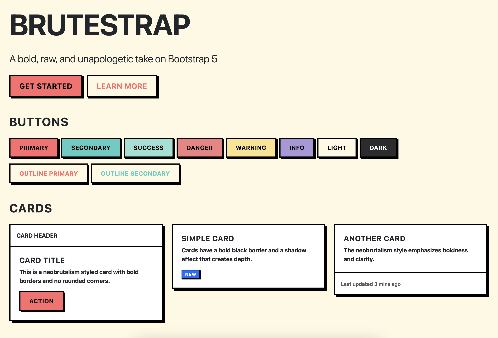

# Brutestrap

**A Neobrutalist take on Bootstrap 5**

Brutestrap is a Neobrutalism-themed CSS framework built on top of Bootstrap 5. It transforms the polished, rounded aesthetic of Bootstrap into a bold, geometric, and high-contrast design language.

Visit [brutestrap.com](https://brutestrap.com) to see Brutestrap in action and learn more.



## Features

- **Neobrutalism Design**: Bold black borders, bright colors, flat design
- **Bootstrap 5 Compatible**: Works with all Bootstrap 5 components
- **Zero Dependencies**: Just CSS, no JavaScript required
- **Easy to Use**: Simply include the CSS file after Bootstrap
- **Customizable**: CSS variables for easy theming

For more information, visit [brutestrap.com](https://brutestrap.com).

## Quick Start

1. Include Bootstrap 5 CSS in your HTML:
```html
<link href="https://cdn.jsdelivr.net/npm/bootstrap@5.3.2/dist/css/bootstrap.min.css" rel="stylesheet">
```

2. Include Brutestrap CSS after Bootstrap:
```html
<link rel="stylesheet" href="brutestrap.css">
```

3. That's it! All your Bootstrap components will now have the Neobrutalism style.

## Design Principles

Brutestrap follows Neobrutalism design principles:

- **Bold Borders**: 3px solid black borders on all components
- **No Rounded Corners**: Sharp, geometric edges
- **High Contrast**: Bright, saturated colors against black and white
- **Flat Design**: No shadows (except for the brutal shadow effect)
- **Bold Typography**: Heavy font weights and uppercase text
- **Brutal Shadows**: Box shadows that create a 3D effect (4px 4px 0px)

## Color Palette

- **Primary**: `#FF6B6B` (Coral Red)
- **Secondary**: `#4ECDC4` (Turquoise)
- **Success**: `#95E1D3` (Mint Green)
- **Danger**: `#F38181` (Light Red)
- **Warning**: `#FCE38A` (Yellow)
- **Info**: `#AA96DA` (Lavender)
- **Light**: `#FFF9E3` (Cream)
- **Dark**: `#2C2C2C` (Dark Gray)
- **Black**: `#000000`
- **White**: `#FFFFFF`

## Customization

You can customize Brutestrap by overriding CSS variables:

```css
:root {
  --bs-brutal-border-width: 3px;
  --bs-brutal-border-color: #000000;
  --bs-brutal-border-radius: 0;
  --bs-brutal-font-weight: 700;
  --bs-brutal-letter-spacing: -0.02em;
  
  /* Colors */
  --bs-brutal-primary: #FF6B6B;
  --bs-brutal-secondary: #4ECDC4;
  /* ... etc */
}
```

## Components Styled

All Bootstrap 5 components are styled with the Neobrutalism theme. See them all at [brutestrap.com](https://brutestrap.com):

- Buttons
- Cards
- Forms (inputs, selects, checkboxes, radios)
- Alerts
- Badges
- Navbar
- Dropdowns
- Modals
- Tables
- Pagination
- Progress bars
- List groups
- Breadcrumbs

## Utility Classes

Brutestrap includes some utility classes:

- `.shadow-brutal` - Standard brutal shadow (4px 4px 0px)
- `.shadow-brutal-lg` - Large brutal shadow (8px 8px 0px)
- `.shadow-brutal-sm` - Small brutal shadow (2px 2px 0px)
- `.border-brutal` - Standard brutal border (3px solid black)
- `.border-brutal-thick` - Thick brutal border (5px solid black)

## Browser Support

Brutestrap works with all modern browsers that support Bootstrap 5:
- Chrome (latest)
- Firefox (latest)
- Safari (latest)
- Edge (latest)

## Examples

Check out `index.html` for a comprehensive showcase of all styled components, or visit [brutestrap.com](https://brutestrap.com) to see live examples.

## License

This project is open source and available under the [MIT License](LICENSE).

## Press the :star: button

Don't forget to press the :star: button to let me know I should continue improving this project.


